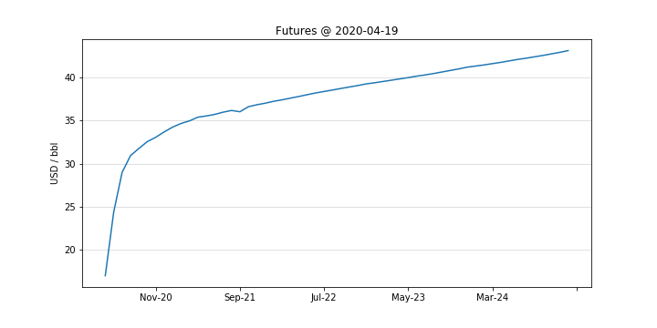
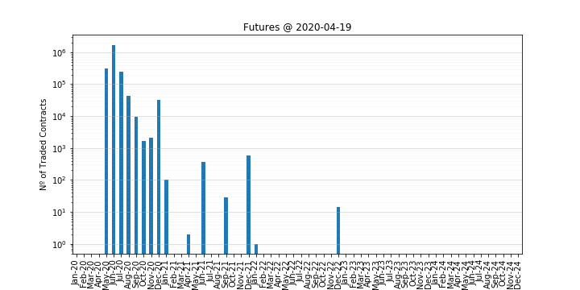

# Oil Futures Data Plotting
Easy plot WTI oil futures data.

This repo includes two files:
- oil_futures.py
- oil_functions.py

## oil_futures.py
This file includes the main function which is based on *oil_functions.py*.
It outputs two plots, as the following (e.g. for 4 forward years):

**Prices Plot**

**Volume Plot**

## oil_functions.py
This file includes 3 functions:
- *getdata(period)*: it gets the futures data for the years requested and with the trading history of the requested *period*. When executed, it requests an input, which must be an integer representing the number of years of future prices we want to download. It downloads data using [yfinance](https://pypi.org/project/yfinance/).
It outputs two DataFrames with prices and volumes traded in the *period*.
- *price_plot(prices)*: plots yesterday's prices
- *volume_plot(volume)*: plots yesterday's traded volume in log scale
